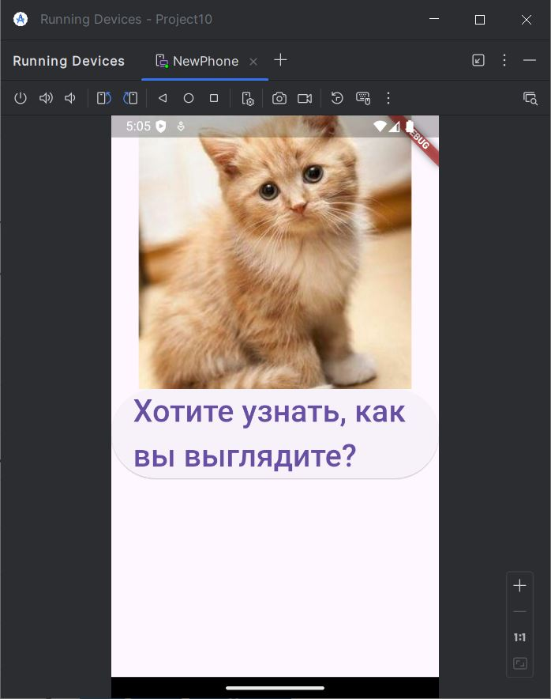
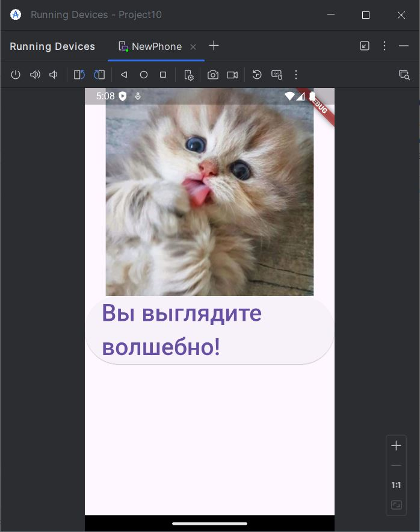
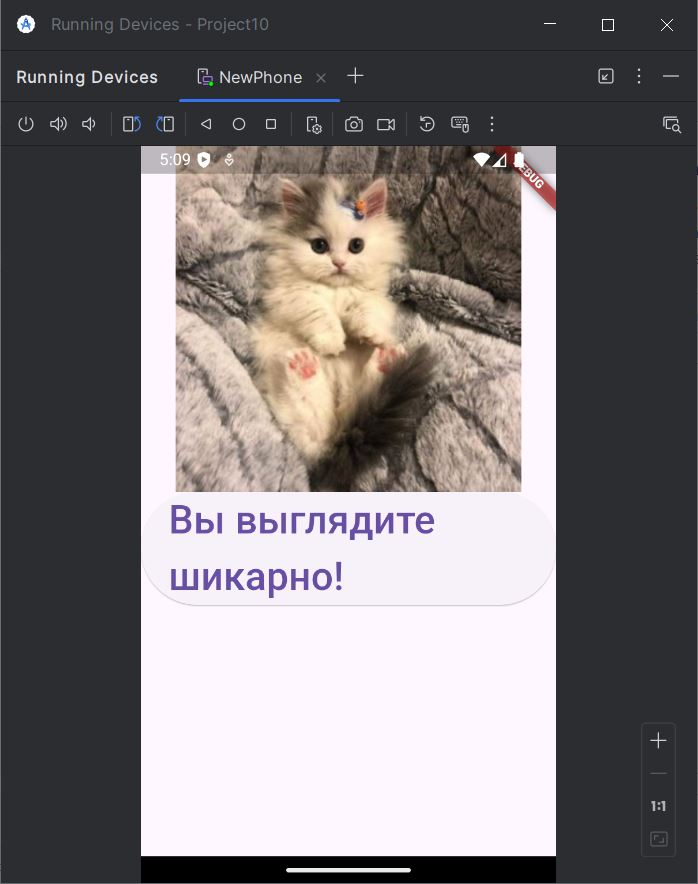
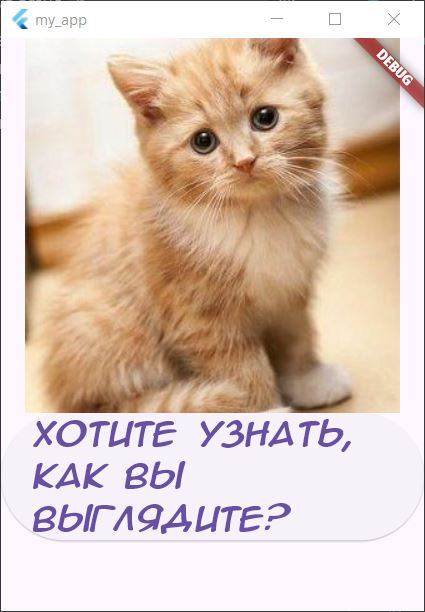
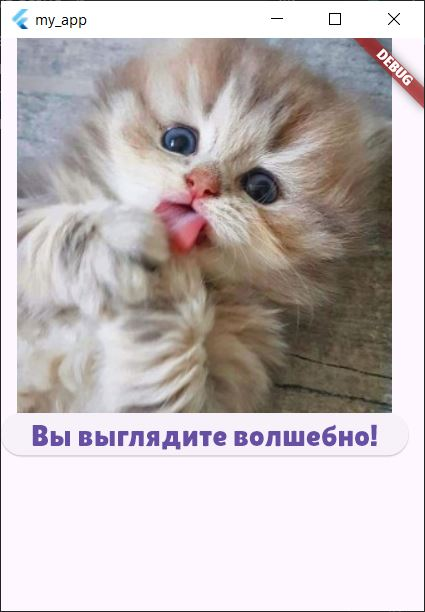

# Работа с кроссплатформенным фреймворком Flutter
### 1. Начало работы с Flutter
С помощью Visual Code установил плагин для работы с Flutter и создал первый проект с дефолтным приложением, после чего протестировал его работу в Windows приложении и эмуляторе Android.
### 2. Использование собственных виджетов
Переработал файл `main.dart`, создав в нем собственные виджеты и использовав их в главной функции
```dart
import 'package:flutter/material.dart';

void main() {
  runApp(MaterialApp(
    home: Scaffold(body: MyClass()),
  ));
}

class MyClass extends StatefulWidget {
  MyClass({super.key});
  @override
  _MyClassState createState() => _MyClassState();
}

class _MyClassState extends State<MyClass> {
  //Варианты переменных для изменения по нажатию
  String currentText = "Хотите узнать, как вы выглядите?";
  List<String> endings = [" чудесно!", " волшебно!", " шикарно!"];
  List<String> images = ["assets/images/cat1.jpeg", "assets/images/cat2.jpg", "assets/images/cat3.jpg"];
  int index = 0;

  @override
  Widget build(BuildContext context) {
    return Column(children: [
      Image.asset(images[index]),
      ElevatedButton(
          onPressed: () {
            setState(() {
              index = (index + 1) % endings.length; // Циклический переход
              currentText = "Вы выглядите${endings[index]}";
            });
          },
          child: Text(currentText, style: TextStyle(fontSize: 34)))
    ]);
  }
}
```
>Для добавления фотографий создал специальную папку "assets", а в файле `pubspec.yaml` прописал дирректории:
```dart
  uses-material-design: true
  assets:
  - assets/
  - assets/images/
```
Ниже приведены скриншоты работы программы:<br>
<br>
<br>
<br>

>Для добавления фотографий создал специальную папку "fonts", а в файле `pubspec.yaml` прописал дирректории:

```dart
 fonts:
    - family: TrueType
      fonts:
        - asset: fonts/animeAce.ttf
    - family: OpenType
      fonts:
        - asset: fonts/lilita.otf
    - family: TenorSans
      fonts:
        - asset: fonts/tenorSans.ttf
```
Ниже приведены скриншоты работы программы:<br>
<br>
<br>

### 3. Использование виджетов для добавления отступов и выравнивания

Использовал виджеты `Center` и `Padding` чтобы расположить ранее созданные части интерфейса в центре и добавить отступы для виджета с картинкой

```dart
@override
  Widget build(BuildContext context) {
    return Center(
        child: Column(
            mainAxisAlignment: MainAxisAlignment.center,
            crossAxisAlignment: CrossAxisAlignment.center,
            children: [
          Padding(
            padding: EdgeInsets.all(30),
            child: Image.asset(images[index]),
          ),
          ElevatedButton(
              onPressed: () {
                setState(() {
                  index = (index + 1) % endings.length; // Циклический переход
                  currentText = "Вы выглядите${endings[index]}";
                });
              },
              child: Text(currentText,
                  style: TextStyle(fontFamily: fonts[index], fontSize: 24)))
        ]));
  }
```

