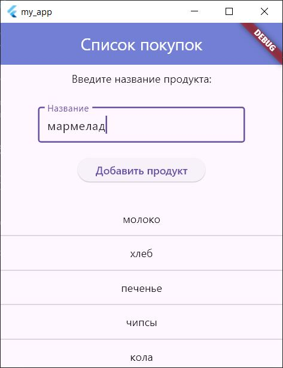
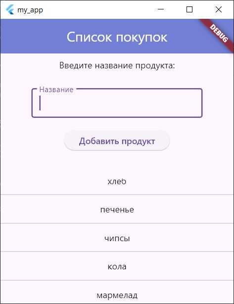
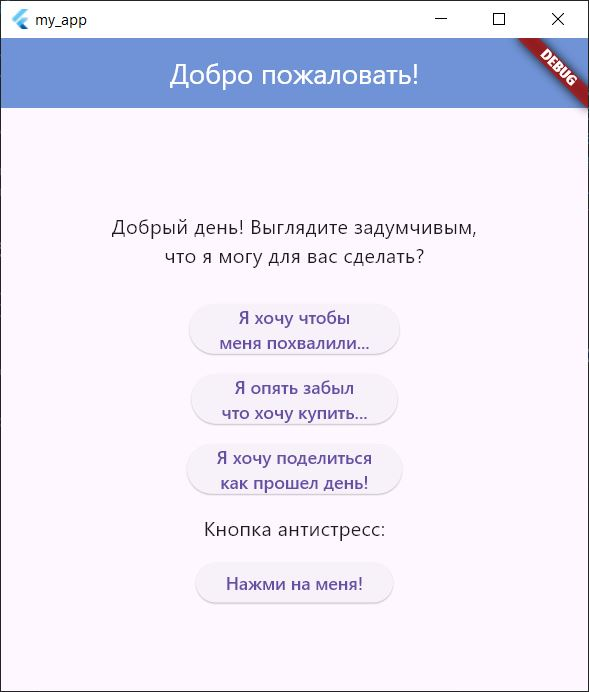
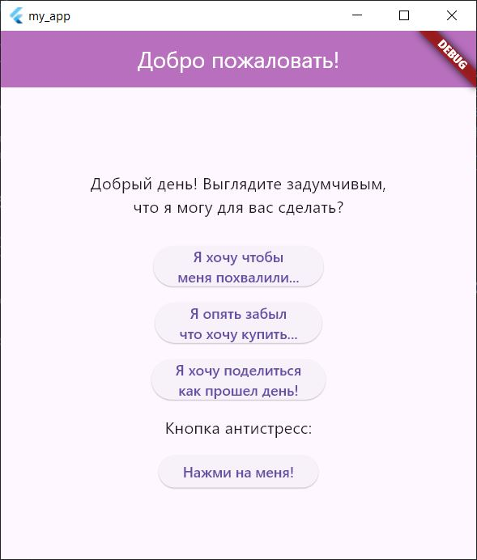
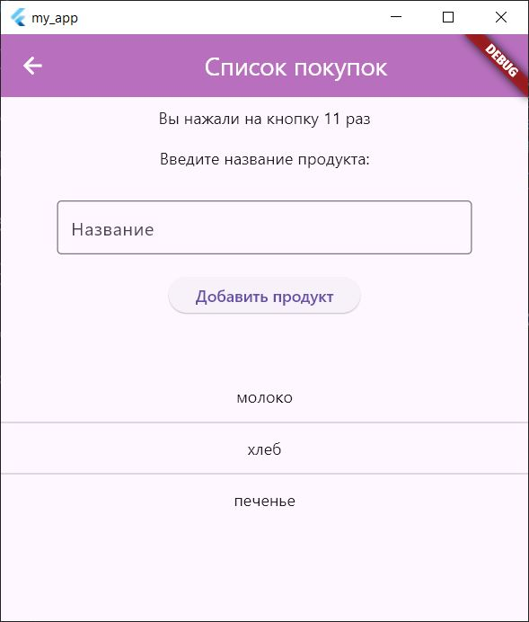

# Работа с кроссплатформенным фреймворком Flutter
### 1. Начало работы с Flutter
С помощью Visual Code установил плагин для работы с Flutter и создал первый проект с дефолтным приложением, после чего протестировал его работу в Windows приложении и эмуляторе Android.
### 2. Использование собственных виджетов
Переработал файл `main.dart`, создав в нем собственные виджеты и использовав их в главной функции
```dart
import 'package:flutter/material.dart';

void main() {
  runApp(MaterialApp(
    home: Scaffold(body: MyClass()),
  ));
}

class MyClass extends StatefulWidget {
  MyClass({super.key});
  @override
  _MyClassState createState() => _MyClassState();
}

class _MyClassState extends State<MyClass> {
  //Варианты переменных для изменения по нажатию
  String currentText = "Хотите узнать, как вы выглядите?";
  List<String> endings = [" чудесно!", " волшебно!", " шикарно!"];
  List<String> images = ["assets/images/cat1.jpeg", "assets/images/cat2.jpg", "assets/images/cat3.jpg"];
  int index = 0;

  @override
  Widget build(BuildContext context) {
    return Column(children: [
      Image.asset(images[index]),
      ElevatedButton(
          onPressed: () {
            setState(() {
              index = (index + 1) % endings.length; // Циклический переход
              currentText = "Вы выглядите${endings[index]}";
            });
          },
          child: Text(currentText, style: TextStyle(fontSize: 34)))
    ]);
  }
}
```
>Для добавления фотографий создал специальную папку "assets", а в файле `pubspec.yaml` прописал дирректории:
```dart
  uses-material-design: true
  assets:
  - assets/
  - assets/images/
```
Ниже приведены скриншоты работы программы:<br>
<br>
<br>
<br>

>Для добавления фотографий создал специальную папку "fonts", а в файле `pubspec.yaml` прописал дирректории:

```dart
 fonts:
    - family: TrueType
      fonts:
        - asset: fonts/animeAce.ttf
    - family: OpenType
      fonts:
        - asset: fonts/lilita.otf
    - family: TenorSans
      fonts:
        - asset: fonts/tenorSans.ttf
```
Ниже приведены скриншоты работы программы:<br>
<br>
<br>

### 3. Использование виджетов для добавления отступов и выравнивания

Использовал виджеты `Center` и `Padding` чтобы расположить ранее созданные части интерфейса в центре и добавить отступы для виджета с картинкой

```dart
@override
  Widget build(BuildContext context) {
    return Center(
        child: Column(
            mainAxisAlignment: MainAxisAlignment.center,
            crossAxisAlignment: CrossAxisAlignment.center,
            children: [
          Padding(
            padding: EdgeInsets.all(30),
            child: Image.asset(images[index]),
          ),
          ElevatedButton(
              onPressed: () {
                setState(() {
                  index = (index + 1) % endings.length; // Циклический переход
                  currentText = "Вы выглядите${endings[index]}";
                });
              },
              child: Text(currentText,
                  style: TextStyle(fontFamily: fonts[index], fontSize: 24)))
        ]));
  }
```

### 4. Использование ListView для создания "Списка покупок"

Создал новый файл `product_list.dart` для реализации экрана с возможностью добавления пользователем
определенного продукта в список покупок. Для отображения самого списка использовал виджет `ListView` с конструктором `separeted`, который предоставит возможность использовать разделитель `Divider`

```dart
class ListClass extends StatefulWidget {
  ListClass({super.key});
  @override
  _ListClassState createState() => _ListClassState();
}

class _ListClassState extends State<ListClass>{
  
  TextEditingController controller = TextEditingController();
  void addToList(){
    String product = controller.text;
    if (product.isNotEmpty) {
    setState(() {
      products.add(product);
    });
    controller.clear();
  }
  }
  List<String> products = ['молоко', 'хлеб', 'печенье'];

  @override
  Widget build(BuildContext context) {
    return Scaffold(
      appBar: AppBar(
        backgroundColor:Color.fromARGB(255, 115, 132, 217),
        foregroundColor: Color.fromARGB(255, 255, 255, 255),
        title: 
        Center(
          child: Text("Список покупок"),
        )
      ),
      body: Center(
        child: Column(
          children: [
            Expanded(
              flex: 2,
              child: Column(
                children: [
                  Padding(
                    padding: const EdgeInsets.all(8.0),
                    child: Text("Введите название продукта:"),
                  ),
                  Padding(
                    padding: const EdgeInsets.fromLTRB(50.0, 20.0, 50.0, 20.0),
                    child: TextField(
                      controller: controller,
                      decoration: InputDecoration(
                        border: OutlineInputBorder(),
                        labelText: "Название",
                      )
                    ),
                  ),
                  ElevatedButton(
                    onPressed: addToList,
                    child: Text('Добавить продукт'),
                    )
                ],
              )
            ),
            Expanded(
              flex: 2,
              child:
              ListView.separated(
              itemBuilder: (BuildContext context, int index){
                return Container(
                  height: 30,
                  child: Center(child: Text(products[index]),),
                );
              },
              separatorBuilder: (BuildContext context, int index) => const Divider(),
              itemCount: products.length
              )
            )
          ],
        ),
      )
    );
  }
}
```
Ниже приведены скриншоты работы программы:<br>

<br>

### 5. Настройка навигации между экранами

Создал новый виджет `Homepage` на котором разместил приветственное сообщение и кнопки
для перехода на вновь созданные экраны

```dart
class Homepage extends StatelessWidget{
  const Homepage({super.key});
  @override
  Widget build(BuildContext context) {
    return Scaffold(
      appBar: AppBar(
        backgroundColor: Color.fromARGB(255, 115, 132, 217),
        foregroundColor: Color.fromARGB(255, 255, 255, 255),
        title: Center(child: Text('Добро пожаловать!')),
      ),
      body: Center(
        child: Column(
          mainAxisAlignment: MainAxisAlignment.center,
          children: [
            Padding(
              padding: const EdgeInsets.fromLTRB(0, 20, 0, 20),
              child: Text('Добрый день! Выглядите задумчивым,\nчто я могу для вас сделать?',
              style: TextStyle(fontSize: 16),
              textAlign: TextAlign.center,),
            ),
            Padding(
              padding: const EdgeInsets.all(8.0),
              child: ElevatedButton(
                onPressed:(){ Navigator.pushNamed(context, '/lookcheck');},
                child: Text('Я хочу чтобы\nменя похвалили...', textAlign: TextAlign.center,)
                ),
            ),
            Padding(
              padding: const EdgeInsets.all(8.0),
              child: ElevatedButton(
                onPressed:(){ Navigator.pushNamed(context, '/products');},
                child: Text('Я опять забыл\nчто хочу купить...', textAlign: TextAlign.center)
                ),
            )
          ],
        ),
      )
    );
  }
}
```
>Для перехода на другие экраны использовал навигацию по имени, которую описал в
>отдельном виджете, который в последующем будет вызываться в главной функции

```dart
class MyApp extends StatelessWidget {
  const MyApp({super.key});
  @override
  Widget build(BuildContext context) {
    return MaterialApp(
      title: 'Пример навигации',
      initialRoute: '/',
      routes: {
        '/': (context) => Homepage(),
        '/lookcheck': (context) => MyClass(),
        '/products': (context) => ListClass(),
      },
    );
  }
}
```
### 5. Управление состоянием с помощью InheretedWidget
На главной странице создал кнопку, по которой пользователь может нажать и поменять цвет `AppBar` у виджета. Чтобы перенести данную настройку цвета на `AppBar` на остальных экранов, создал новый виджет, расширяющий `InheretedWidget`
```dart
import 'package:flutter/material.dart';
import 'package:my_app/app_data.dart';

class AppDataProvider extends InheritedWidget{
  const AppDataProvider(
    {required this.appData, required super.child, super.key}
  );

  final AppData appData;
  static AppDataProvider? of(BuildContext context) =>
      context.dependOnInheritedWidgetOfExactType<AppDataProvider>();
  
  @override
  bool updateShouldNotify(covariant InheritedWidget oldWidget) {
    return true;
  }
}
```
>Созданный класс использовал для получения информации о цвете
>из виджетов на других экранах
```dart
//Класс Daychek на втором экране

@override
  Widget build(BuildContext context) {
    final Map<String, int> counter = ModalRoute.of(context)!.settings.arguments as Map<String, int>;
    var data = context.dependOnInheritedWidgetOfExactType<AppDataProvider>();
    return Scaffold(
      appBar: AppBar(
        backgroundColor: data?.appData.backColor,
        foregroundColor: Color.fromARGB(255, 255, 255, 255),
        title: Center(child: Text('Генератор комплиментов')),
      ),
    )
      ...
  }
```
Ниже приведены скриншоты работы программы:<br>


<br>
